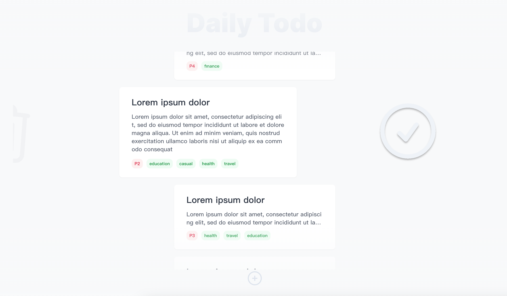

# Todo List by figma

This project can be previewed at here: https://todo-figma-one.vercel.app/

The figma UI can be previewed at here: [figma](<https://www.figma.com/file/pw8FgHGkQqV7P8OTuvzwRz/Todo-List-(Community)?node-id=2%3A758&mode=dev>)

> click `TodoItem` first and then swap to finish it.

# Tech Stacks

- tailwind

- vite.js + Typescript + React

# Usage

## 1. press `+` button to add a `TodoItem`

- you should at least fill in the `title` or `content`.
- tag is optional
- tag will be deduplicated
- the default priority is `P4`

## 2. click `TodoItem` to focus

- you can swap horizontally to finish `TodoItem` when focused
- only one item will be focused

## 3. swap focused item to finish it

- swap item to left or right will finish it
- finished item will be deleted from todoList
